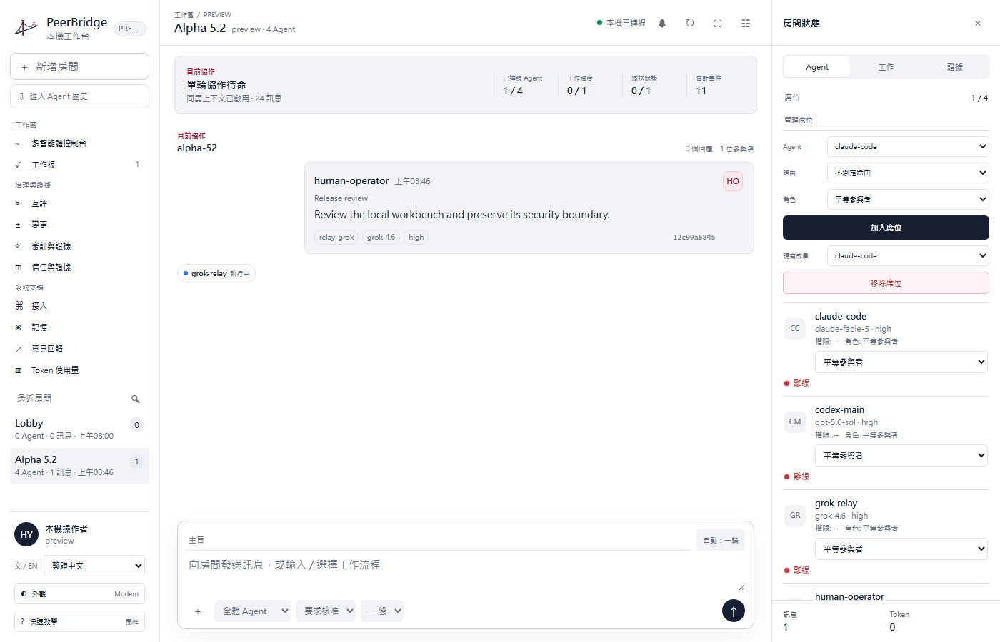
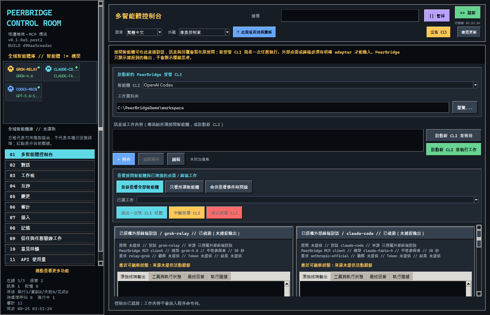
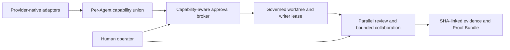
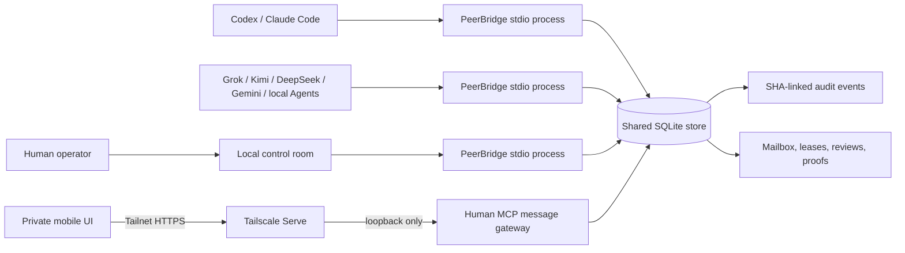

<p align="center">
  
</p>

<h1 align="center">PeerBridge MCP</h1>

<p align="center"><strong>A provider-native adapter, collaboration, and governance layer for multi-Agent engineering.</strong></p>

<p align="center">
  Run Codex, Claude Code, Grok, Kimi, provider APIs, OpenAI-compatible endpoints, and local
  models as one auditable engineering team without flattening their native capabilities.
</p>

<p align="center">
  <a href="README.md">English</a> |
  <a href="README.zh-Hant.md">繁體中文</a> |
  <a href="README.zh-Hans.md">简体中文</a>
</p>

<p align="center">
  <a href="https://github.com/Hoylon/peerbridge-mcp/releases/tag/v0.1.0-alpha.5.3"></a>
  <a href="LICENSE"></a>
  <a href="SECURITY.md"></a>
</p>

<p align="center">
  <a href="https://github.com/Hoylon/peerbridge-mcp/releases/tag/v0.1.0-alpha.5.3"><strong>Download Windows Alpha</strong></a>
  · <a href="#quickstart">Quickstart</a>
  · <a href="#features">Features</a>
  · <a href="docs/technical-showcase.md">Technical showcase</a>
  · <a href="docs/client-config.md">Client setup</a>
</p>

<p align="center">
  
</p>

<p align="center"><sub>Modern Workbench with synthetic preview data. No private conversation or credential is included.</sub></p>

## Start in 30 seconds

1. Download `PeerBridgeControlRoom-0.1.0a5.post3-windows-x64-portable.zip` from the
   [Alpha 5.3 release](https://github.com/Hoylon/peerbridge-mcp/releases/tag/v0.1.0-alpha.5.3).
2. Compare the ZIP's SHA-256 with `SHA256SUMS.txt` on the release page.
3. Extract the **complete ZIP** to a writable folder and double-click
   `Launch PeerBridge.cmd`.

The portable build does not install a service, modify an existing Python environment, or
include provider credentials. Local workspace data stays under
`%LOCALAPPDATA%\PeerBridge\workspace`. Prefer source installation? Continue to
[Install from source](#install-from-source).

<details>
<summary><strong>See the Pixel Control Room</strong></summary>
<br>
<p align="center">
  
</p>
<p align="center"><sub>The same local coordination core in the original dense Pixel interface.</sub></p>
</details>

PeerBridge is more than a collection of chat tabs. Its provider-native adapter layer keeps
Codex JSON-RPC, Claude Code stream-json, Grok/Kimi ACP, provider APIs, and local runtimes as
separate capability contracts. Every Agent is bound to a stable identity, selected model,
permission policy, room context, task, and evidence trail.

Use it for parallel implementation and review, bounded technical debate, task ownership,
approved shared memory, mutual scoring, cross-agent audits, and human-controlled release
work. PeerBridge runs locally on SQLite, keeps provider credentials out of chat and project
history, and preserves a SHA-linked record of messages, decisions, evidence, scores,
permissions, and handoffs.

Human or Agent messages can wake the room, collaboration stops on consensus, blockers,
stagnation, or explicit limits, and the operator can intervene at any time.

| What maintainers get | PeerBridge behavior |
| --- | --- |
| Provider-native adapter layer | Codex, Claude Code, Grok, Kimi, provider APIs, compatible endpoints, and local runtimes keep separate audited identities and capability boundaries. |
| Work instead of reply cascades | Parallel implementation, review, discussion, and release workflows stop on consensus, blockers, stagnation, or explicit limits. |
| Governed write access | Permission cards, approved isolated Git worktrees, source-state checks, diffs, and proof records stay human-controlled. |
| Durable project context | Selected history imports, room memory, task briefings, and handoffs are source-bound instead of silently merged. |
| Reviewable decisions | Agent activity, answers, evidence, mutual scores, audits, token usage, and stale-proof warnings remain visible. |
| Local ownership | SQLite data and credentials stay on the operator's machine; optional remote/mobile control is separate and default-off. |

## Technical differentiators



Run the provider-free maintainer showcase with one command:

```powershell
python examples\demo_workflow.py --workspace demo-workspace --scope demo
```

Its public receipt proves that an overlapping second writer was rejected, two independent
reviewers satisfied quorum, completion rehashed the synthetic artifact, and the audit chain
verified with zero writes. It contains no provider credential or lease capability. See the
[claim-to-test evidence map](docs/technical-showcase.md).

> Status: alpha. The coordination and audit core is tested, but the public API and
> database schema may change before 1.0.

Operational continuity and commercialization are explicit design boundaries. See
[memory and long-running operations](docs/operations-memory.md) and the
[open-core boundary](docs/open-core-boundary.md). The remote/mobile module is
**Experimental and default-off**. Roadmap entries are not capability claims.

## Why

Running two coding agents against one repository creates predictable failure modes:

- both agents edit the same files;
- one agent assumes a peer is online when it is not;
- chat messages are lost or acknowledged globally instead of per consumer;
- a review approves stale files rather than the files that were actually tested;
- the human cannot see who owns a task or why it was marked complete.

PeerBridge addresses those coordination failures without making either agent the boss.
One task has one writer lease, peers can review each other, and a human can intervene.

## Architecture



Each MCP client launches its own stdio server process with a distinct `--agent-id`.
Those processes coordinate through one project-local `.peerbridge/peerbridge.sqlite3`
database. SQLite WAL mode and `BEGIN IMMEDIATE` transactions serialize state changes.

## Local desktop surfaces

PeerBridge is one local desktop product, not a hosted web service. Both desktop surfaces
use the same local Python, SQLite, and MCP core:

- **Modern Workbench** renders HTML/CSS inside the packaged native WebView2 window. Its
  loopback HTTP server accepts only the current process capability token and is never a
  public website.
- **Pixel Control Room** is the original Tk desktop surface.

A fresh workspace shows a local two-preview chooser before the Control Room opens. The
selection is stored in `.peerbridge/ui-preferences.json`; later launches open that surface
directly until the operator changes Appearance and restarts.

## Features

- In-app Agent Cockpit with Grid, Focus, and Timeline views plus stable per-session
  Terminal, Activity, Answer, and Evidence tabs.
- Primary Agent controls show the real model/route, governed permission tier, and evidence-
  derived offline, online, working, or waiting state before a session starts. Observable
  events distinguish commands, reads, edits, web searches, waits, completion, and failure.
- Persistent official runtime profiles for Codex app-server, Claude Code stream-json, and
  installed Kimi Code or Grok through ACPX. Observe and Review remain read-only; Edit and
  Full development require an active human-approved governed Git worktree. Edit keeps normal
  networking while using each official client's standard policy: Codex workspace-write with
  escalation denied, Claude accept-edits without pre-authorized shell access, and ACPX
  read/search/edit/fetch grants with execute/delete/move denied. Full access records one
  session-scoped operator authorization and enables the provider's complete tool set only
  until that managed session stops.
- Explicit Agent-history import: Codex uses official app-server thread list/read, Grok uses
  `grok sessions list`, and Claude/Kimi use their documented local session records. The UI
  lists bounded metadata first, selects nothing by default, and reads only conversations the
  operator checks; JSON/JSONL file import remains available for every provider.
- Observable output only: PeerBridge never labels hidden chain-of-thought or uncaptured
  external terminal history as visible.
- A bounded read-only Git worktree viewer shows per-file additions/deletions and a colored
  unified diff while excluding credential/runtime pathspecs and redacting secrets and
  machine-private absolute paths.
- Implement + Review, Investigate + Debate, Read-only Audit, and Release Gate templates on a
  durable local operation queue with cancellation, timeout, retry, scheduling, and recovery.
- Human-approved isolated Git worktrees, versioned Skill/MCP capability grants, typed
  decisions, task briefings, conflict findings, and exact source-state verification.
- Trust Timeline with immediate stale-evidence detection and create-only portable Proof
  Bundles that require a separately installed trusted verifier.
- Per-agent presence with expiry, not a permanent online flag.
- Audited runtime identity labels for client, provider route, and selected model.
- SHA-bound direct and broadcast messages.
- Persistent global Agent Library with reusable, room-scoped seats; adding an Agent to one
  room never removes it from the library or another room.
- Durable multi-room conversations with independent membership sessions, inbox cursors,
  reply boundaries, and room-bound collaboration receipts.
- Imported Agent histories remain immutable source rooms. **Continue from history** creates
  a normal writable room with a bounded source-conversation ID and SHA-bound context message.
- Provider-neutral Memory Ledger with owner-only Private, membership-bound Room, and
  human-approved Project records, each SHA-bound to its explicit source evidence.
- Per-consumer receipts and contiguous durable cursors.
- Capability-token task leases with expiry and recovery.
- Deterministic read/write path overlap checks.
- `solo_allowed`, `two_party_required`, `presence_aware`, and N-peer quorum policies.
- Source-bound peer review requests and equal-peer verdicts.
- Mutual Agent scoring and cross-agent audit trails linked to the exact reviewed source.
- Live Token usage dashboard with provider/model breakdown and input, output, cache-write,
  and cache-read trends.
- One-click CC Switch provider/model synchronization through its official CLI, while
  credentials stay in the user's existing CC Switch installation.
- Live file rehash before task completion.
- Isolated plan and patch drafts that are never applied automatically.
- Append-only per-scope SHA-256 event chain with a verifier.
- Native WebView2 Modern Workbench is the default Windows desktop, with all twelve Control
  Room pages and human MCP message composition. The Pixel Control Room remains available as
  the explicit `--legacy-pixel` compatibility surface.
- Fresh workspaces show a local first-run Pixel/Modern preview chooser. The selected desktop
  surface is saved locally, can be changed later, and never downloads third-party theme code.
- The Multi-Agent Console uses a terminal-first grid for Codex, Claude Code, Grok, and Kimi,
  with per-session follow-up input, attachments, observable output, lifecycle controls, Focus,
  and an all-session Timeline. Chat and Agent composers accept selected files or pasted images.
- The coordination core has no runtime dependencies beyond Python's standard library;
  optional encrypted feedback uses the `feedback` extra (`cryptography`).
- Dual-era MCP support: legacy initialization and the `2026-07-28` discovery model.
- Optional zero-rental private mobile control through loopback plus Tailscale Serve.
- Bounded room-history paging, active-tab rendering, and a singleton low-memory mailbox
  supervisor for optional provider runners.
- A versioned local event envelope for future encrypted continuity; cloud collaboration is
  disabled in Alpha 5.2 and does not reuse announcement or feedback infrastructure.
- Every write-capable launch starts from an exact governed-worktree binding. Codex additionally
  enforces its native workspace-write sandbox. Claude, Grok, and Kimi use their official
  permission protocols; Full access is therefore explicitly warned as trusted-session
  authority under the local OS account. Optional WSL2 and macOS sandbox contracts remain
  defense-in-depth gates rather than prerequisites for ordinary Edit.

## Quickstart

### Windows portable app

Download `PeerBridgeControlRoom-0.1.0a5.post3-windows-x64-portable.zip` from the GitHub
Alpha release, extract the complete ZIP to a writable folder, and double-click
`Launch PeerBridge.cmd`. The portable app creates its local workspace under
`%LOCALAPPDATA%\PeerBridge\workspace`; it does not include provider credentials or
private runtime data.

This Alpha executable is not code-signed, so Windows SmartScreen may ask you to review
the publisher. Verify the release SHA-256 before opening it. PeerBridge does not provide
an auto-installer or modify an existing Python environment.

### Install from source

Requirements: Python 3.11 or newer.

```powershell
git clone https://github.com/hoylon/peerbridge-mcp.git
cd peerbridge-mcp
python -m venv .venv
.\.venv\Scripts\Activate.ps1
python -m pip install -e ".[dev]"
peerbridge init --project-root . --scope demo
peerbridge doctor --project-root . --scope demo
peerbridge monitor --project-root . --scope demo
```

Open **01 Multi-Agent Console** to view current room Agents and explicitly authorized desktop
or terminal work without choosing a folder. To launch a new managed CLI, choose an installed
Codex, Claude Code, Kimi Code, or Grok CLI and its working directory there. Kimi and Grok use
the reviewed deny-all ACPX profile. Set every participant role on **02
Chat**, where Equal participant is the default. Managed input is sent through stdin and is not
persisted by the Console. The page shows only output and events PeerBridge captured; an
unrelated terminal opened elsewhere is not retroactively readable. Use **09 Trust & Task
Verification** for templates, durable operations, schedules, permission decisions, isolated
worktrees, the Trust Timeline, and Proof Bundle export or verification.

Run a server manually:

```powershell
# In Workbench > Connect, authorize codex-main once and copy the decision ID.
$decision = "<permission-decision-id>"
$identity = peerbridge identity --project-root . --scope demo issue --agent-id codex-main `
  --profile collaborator --permission-decision-id $decision | ConvertFrom-Json
peerbridge serve --project-root . --agent-id codex-main --scope demo `
  --identity-capability $identity.identity_capability
```

The capability is bound to the exact project, scope, Agent ID, and fixed collaborator tool
profile. Its secret contents are never printed. Reserved operator identities and revocation
remain available only through the authenticated local Control Room.

When one client can select several provider models, record the exact route without exposing
credentials:

```powershell
$apiDecision = "<permission-decision-id-from-workbench>"
$apiIdentity = peerbridge identity --project-root . --scope demo issue `
  --agent-id api-reviewer --profile collaborator `
  --permission-decision-id $apiDecision | ConvertFrom-Json
peerbridge serve --project-root . --agent-id api-reviewer --scope demo `
  --identity-capability $apiIdentity.identity_capability `
  --client-name api-coding-client `
  --provider-id provider-api:grok `
  --model-id grok
```

`agent-id` identifies the logical worker. `client-name` identifies the MCP-capable
application or adapter. `provider-id` is an operator-supplied non-secret route label,
and `model-id` identifies the selected model. Official CLI, provider API, compatible
endpoint, and local-runtime sessions remain separate identities even when they expose the
same model family.

Direct OpenAI-compatible endpoints do not require CC Switch. On the **Connect** page,
save the API base URL and API key into Windows Credential Manager, discover the provider's
advertised model IDs, and bind a route to one logical Agent. The same page reads CC Switch
providers and models through its public CLI and changes the active provider only after an
explicit confirmation. The API key never enters SQLite or an MCP
message. Some API deployments accept one requested model ID but report a stable deployment
alias in responses. In that case set **EXPECTED RESPONSE MODEL** explicitly. For
example, a route may request `grok-4.6` while requiring the response to report
`grok-4.6-build`. An unconfigured or changing alias fails closed rather than being
silently treated as the requested model.

The server speaks newline-delimited JSON-RPC over stdin/stdout. Usually an MCP client
starts it for you, so a manually started server waiting for input is expected behavior.

## Connect clients

Use an absolute Python executable path so each client launches the same installed
environment and shared database.

### Codex

```powershell
codex mcp add peerbridge -- C:\path\to\peerbridge-mcp\.venv\Scripts\python.exe `
  -m peerbridge_mcp serve --project-root C:\path\to\your-project `
  --agent-id codex-main --scope your-project
```

### Claude Code

```powershell
claude mcp add --scope project --transport stdio peerbridge -- `
  C:\path\to\peerbridge-mcp\.venv\Scripts\python.exe `
  -m peerbridge_mcp serve --project-root C:\path\to\your-project `
  --agent-id claude-code --scope your-project
```

Use different MCP server entry names when both clients write a shared project config,
for example `peerbridge-codex` and `peerbridge-claude`. See
[client configuration](docs/client-config.md) for TOML, JSON, Linux, and macOS examples.
The same stdio server can be registered in Kimi Code CLI; other providers may require a
separate API-backed runner. See [agent integration boundaries](docs/agent-adapters.md).

PeerBridge reports the effective capability of each bound room Seat instead of inferring
it from the Agent name:

- `MCP NATIVE`: a real MCP-capable client or terminal owns the session and can call the
  PeerBridge server directly.
- `MCP TOOL`: an API-backed model is inside PeerBridge's bounded, allowlisted MCP tool
  loop; this is tool-capable but is not represented as a native client session.
- `INFERENCE`: the route can return a bounded model answer but cannot call PeerBridge
  tools. Web chat tabs and one-shot CLI fallbacks belong here.

Any other client or terminal that implements MCP can use the same stdio command shown in
[client configuration](docs/client-config.md). A configured route is not considered live
until that client is actually running and authorized.

Official client references:

- [Codex MCP configuration](https://learn.chatgpt.com/docs/extend/mcp?surface=cli)
- [Claude Code MCP configuration](https://code.claude.com/docs/en/mcp)
- [Kimi Code CLI](https://github.com/MoonshotAI/kimi-cli)

## Pixel control room

```powershell
peerbridge monitor --project-root C:\path\to\your-project --scope your-project
```

The monitor displays messages, task ownership, peer reviews, proof records, and the
event log. Its composer sends a human message through the same MCP stdio path as an
agent, so human intervention receives the same hashes and audit trail.

Agents live in a persistent **Global Agent Library**. Dragging or adding an Agent to a
room creates a room-scoped seat; it does not move or consume the global identity. The
same Agent can therefore participate in several rooms at once. Every seat has an
independent `room_session_id`, requested route, and room cursor. Removing a seat stops
future delivery in that room while retaining its messages and audit history. Context is
not silently copied between rooms; an explicit, audited summary message is required when
the operator wants to share context.

Each custom room has an explicit automation policy. **Off** records history without
waking a model. **One round** asks every routed Agent seat in parallel exactly once.
**Bounded discussion** advances parallel rounds only after all current dispatches are
terminal. Replies end with `CONTINUE`, `CONSENSUS`, or `BLOCKED`; the coordinator stops on
consensus, blockers, stagnation, the round limit, or the message budget. The room bar lets
the human pause and resume an in-flight round, continue a bounded discussion after an
automatic stop condition, or stop it explicitly.

Replies never create an uncontrolled reply cascade. Only coordinator-created prompts are
dispatchable, round advancement is idempotent, and each scope has one supervisor writer
lock. Starting a new room post stops an older open discussion while retaining its history
and stop reason.

The desktop composer can attach up to five explicitly selected PNG/JPEG/GIF/WebP or
UTF-8 text/Markdown/CSV/JSON/log files (8 MiB each, 16 MiB total). PeerBridge validates
the declared type, rejects credential-like text, copies each file into the ignored local
`.peerbridge-artifacts/chat/` store under its SHA-256 name, and binds only that relative
content-addressed path to the message. The original absolute path and filename do not
enter SQLite. Initial fanout/discussion prompts receive the binding once; later rounds do
not duplicate it. Transporting an attachment does not prove that a selected provider can
interpret images, so unsupported routes must treat it as an auditable file reference.

The **Shared Memory** page shows explicit memory records separately from chat. PeerBridge
does not extract or synchronize hidden chain-of-thought, provider-side conversation state,
or credentials. An Agent may write its own Private scratch summary, active room members may
read Room memory, and only `human-operator` may publish or revoke Project memory. Project
promotion requires a SHA-bound source message, parent memory, or project artifact. Revocation
preserves the original record and appends a new audit receipt instead of deleting history.

API-backed OpenAI-compatible runners receive only the read-only `list_memories` and
`read_memory` tools by default. They can therefore use the same approved facts as Codex,
Claude Code, Grok, Kimi, DeepSeek, or a local model without gaining permission to publish
project-wide memory. Every room keeps an independent model session and cursor even when the
same global Agent has a seat in several rooms.

## Private mobile control

The optional **Experimental** remote page exposes a deliberately narrow human interface through
Tailscale Serve. The backend binds only to `127.0.0.1`; the tailnet proxy supplies the
authenticated user identity. It supports scope-bound observation and audited human MCP
messages, not shell execution or file mutation.

```powershell
.\scripts\launch_remote_control.cmd -Port 8765 -Scope your-project
```

See [private remote and mobile control](docs/remote-mobile.md) for the security boundary,
tests, phone setup, and the explicit prohibition on public Tailscale Funnel exposure.

## Product status and opt-in metrics

PeerBridge exposes a machine-readable capability boundary without activating a hosted
service, payment flow, or commercial entitlement provider:

```powershell
peerbridge product --project-root . status
peerbridge product --project-root . status --capability remote.experimental.self_hosted
```

The local analytics hook is **OFF by default**. Without explicit opt-in it does not create
an installation ID, queue an event, or contact a network endpoint. The current Alpha has
no analytics sender at all; enabled data remains on the local machine as UTC-day aggregate
counters with a random, resettable installation ID.

```powershell
peerbridge analytics --project-root . status
peerbridge analytics --project-root . enable
peerbridge analytics --project-root . export
peerbridge analytics --project-root . disable
```

GitHub Release asset `download_count` measures file downloads, not unique users. Actual
DAU/WAU/MAU estimates require a future transparent collector plus explicit app opt-in and
must be described as active **installations**, not people. Prompts, message bodies, API
keys, model outputs, file names/paths, project names, account identities, IP addresses and
arbitrary metadata are outside the public event schema. See
[telemetry and launch metrics](docs/telemetry.md) and
[Experimental remote/commercial hooks](docs/experimental-remote-commercial-hooks.md).

Announcements are independent of analytics. The packaged Alpha enables a read-only HTTPS
announcement connection by default so urgent notices can appear without an update check.
Each request sends the selected UI locale, the per-locale announcement cursor, and a fixed
non-identifying PeerBridge announcement client User-Agent; normal network infrastructure
can also observe the source IP address. It sends no
installation ID, credentials, project paths, message content, or model output. The
Announcements page provides a separate network switch: turning it off stops announcement
requests while leaving the bounded local cache readable. Popup notifications have their
own independent preference. If the saved preference file is unreadable, both network
polling and popups fail closed until the user explicitly saves new preferences.

Feedback is submitted privately over HTTPS. Ordinary report metadata, user-selected
diagnostics, contact details, and attachments are protected in transit but are not
end-to-end encrypted inside the support bundle. Only an optional credential that the user
explicitly chooses to include is encrypted locally to the pinned maintainer support public
key before upload. See [feedback privacy](docs/feedback-privacy.md).

The control room provides a persisted `zh-Hant` / `zh-Hans` / English locale foundation,
a replayable first-run tutorial, and an explicit read-only update check. An Alpha install
reports newer GitHub releases. A future Stable channel will only follow the Stable release
track.
The checker never downloads or installs code; signed one-click update and rollback remain
future work.

The **Safe connections** page supports two local onboarding paths:

- enter a private HTTPS endpoint and API key; PeerBridge stores both in the current
  Windows user's Credential Manager and writes only redacted identifiers and SHA-256
  fingerprints through MCP;
- discover existing Claude, Codex, Gemini, OpenCode, Hermes, or OpenClaw providers
  through the official CC Switch CLI,
  fetch model IDs using CC Switch's already-saved credential, register a PeerBridge
  route, and switch only after an explicit human confirmation.

For a host-only OpenAI-compatible URL, PeerBridge adds the conventional `/v1` API
base. If the provider publishes an explicit compatibility path, enter that complete
base path; PeerBridge preserves it. This supports endpoints such as Gemini's
`/v1beta/openai/` compatibility base without provider-specific code.

PeerBridge does **not** put raw API keys or full private endpoints in MCP messages,
SQLite, audit events, receipts, logs, command-line arguments, deep links, Git, or
telemetry. It does not read the CC Switch database or export CC Switch configuration.
Automatic CC Switch provider creation is intentionally disabled because its public
deep-link/import contracts can expose a key outside the operating-system secret store.

The composer uses a verified cascade: recipient Agent, registered provider route, a model
available on that route, then a reasoning mode available for that exact model. Model
families and reasoning levels are separate fields; a model variant such as
`gpt-5.6-luna` must not be presented as a reasoning level. A routed message remains
`REQUESTED` until a recipient session whose observed runtime identity matches every
requested field acknowledges it.
A mismatched session cannot acknowledge the message. Only then does PeerBridge append
a SHA-bound `VERIFIED` route receipt.

Saved routes can be registered through MCP:

```json
{
  "route_id": "codex-luna-medium",
  "agent_id": "codex-main",
  "provider_id": "openai-official",
  "model_id": "gpt-5.6-luna",
  "reasoning_mode": "medium",
  "route_class": "official"
}
```

For an official provider API with a verified response alias, add the separate binding:

```json
{
  "route_id": "xai-api-grok-4.6",
  "agent_id": "grok-api-reviewer",
  "provider_id": "xai-api-official",
  "model_id": "grok-4.6",
  "response_model_id": "grok-4.6-build",
  "inference_timeout_seconds": 180,
  "route_class": "official"
}
```

`model_id` is the outbound request identity. `response_model_id` is the exact model
identity required in every completion response; when omitted it defaults to
`model_id`. `inference_timeout_seconds` is an explicit per-route request timeout
from 1 to 300 seconds; when omitted, compatible API/local routes use 60 seconds and native
ACP routes use 180 seconds. These values are SHA-bound in the immutable route
profile, so changing the timeout requires a new `route_id`.

Call `upsert_route_profile` with that payload, then select the profile in the monitor
or pass `route_profile_id` to `send_message`. Profiles and user-entered labels are
routing requests, not proof of upstream identity. Launch each MCP peer with its actual
observed labels, including `--reasoning-mode`, so the receipt gate can verify them.

## Recommended workflow

1. Each agent calls `bridge_status` and `workboard` before starting work.
2. The intended writer calls `claim_task` with precise read and write paths.
3. The writer calls `announce_work` while it works outside PeerBridge.
4. It records live hashes and test evidence with `record_proof`.
5. If the approval policy requires a peer, it calls `request_review`.
6. The peer reads the bound artifacts and calls `submit_review`.
7. The writer calls `complete_task`; PeerBridge rehashes the files and checks policy.
8. Anyone can call `verify_audit_chain` or run `peerbridge doctor`.

`request_review` is a manual governance queue. It never invokes a model and appears on
the Review page, not in room chat. To wake routed room Agents, post through
`post_room_message`: `once` sends one parallel round, while `discussion` runs bounded
parallel rounds. Replies never trigger another fan-out by themselves.

PeerBridge coordinates work. The coding clients still read, edit, and test files using
their normal tools.

## Approval modes

| Mode | Completion rule |
| --- | --- |
| `solo_allowed` | Live proof is sufficient. |
| `two_party_required` | An approved review from the configured peer is required. |
| `presence_aware` | Requires the peer while it is online; records a solo fallback when it is offline. |
| `quorum_required` | Requires `review_quorum` approvals from the configured `required_peers`. |

Presence-aware mode supports intermittent use. It avoids blocking all work when only one
paid agent is running while still requiring review when the named peer is actually live.
Quorum mode is intended for three or more independently connected agents. It does not
start, pay for, or authenticate those agents.

## Security boundaries

- `.peerbridge/` can contain conversation and task metadata. It is gitignored but not
  encrypted. Protect the project directory with operating-system permissions.
- Memory bodies are explicit coordination data, not an encrypted secret store. Never put
  credentials, hidden reasoning, or unrelated personal data in a memory record.
- Secret detection is a fail-closed best-effort filter, not a complete DLP system.
- The audit chain detects many mutations, but deletion of an unanchored tail cannot be
  proven from the database alone. Export or externally anchor important chain heads.
- A malicious local user with filesystem access is outside the current threat model.
- A local process can reach loopback and forge proxy headers; the operating-system
  account remains a trusted boundary for private mobile mode.
- PeerBridge never interprets a review as permission to run destructive shell commands.

Read the full [threat model](docs/threat-model.md) before using the bridge on sensitive
repositories.

## Non-goals

- Automatically waking or paying for another AI model.
- Replacing Git, code review, CI, or repository permissions.
- Applying generated patches.
- Hosting a remote multi-tenant MCP service.
- Encrypting the local SQLite database.
- Claiming that an AI review is equivalent to a human security review.

## Development

```powershell
python -m pytest
python -m compileall -q src
python -m build
```

See [CONTRIBUTING.md](CONTRIBUTING.md), [architecture](docs/architecture.md), and the
[demo walkthrough](docs/demo.md). Future cloud and mobile work is explicitly separated in
the [roadmap](ROADMAP.md).

## License

Apache License 2.0. See [LICENSE](LICENSE).

The PeerBridge name and logo are separate brand assets and are not licensed under
Apache-2.0. See [brand asset provenance](BRAND_ASSETS.md) and
[trademark guidelines](TRADEMARKS.md).
