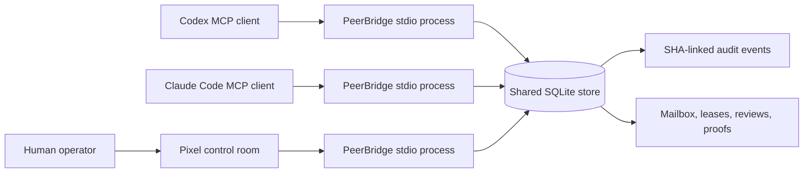

# PeerBridge MCP

Local-first, auditable coordination for equal AI coding peers and their human operator.

PeerBridge gives two or more MCP-capable coding agents a shared mailbox, task leases,
path conflict detection, review requests, proof records, and a tamper-evident event log.
It runs as a local stdio MCP server backed by SQLite. It does not expose a network port,
invoke another model, apply patches, or edit project files on an agent's behalf.

> Status: alpha. The coordination and audit core is tested, but the public API and
> database schema may change before 1.0.

## Why

Running two coding agents against one repository creates predictable failure modes:

- both agents edit the same files;
- one agent assumes a peer is online when it is not;
- chat messages are lost or acknowledged globally instead of per consumer;
- a review approves stale files rather than the files that were actually tested;
- the human cannot see who owns a task or why it was marked complete.

PeerBridge addresses those coordination failures without making either agent the boss.
One task has one writer lease, peers can review each other, and a human can intervene.

## Architecture



Each MCP client launches its own stdio server process with a distinct `--agent-id`.
Those processes coordinate through one project-local `.peerbridge/peerbridge.sqlite3`
database. SQLite WAL mode and `BEGIN IMMEDIATE` transactions serialize state changes.

## Features

- Per-agent presence with expiry, not a permanent online flag.
- Audited runtime identity labels for client, provider route, and selected model.
- SHA-bound direct and broadcast messages.
- Per-consumer receipts and contiguous durable cursors.
- Capability-token task leases with expiry and recovery.
- Deterministic read/write path overlap checks.
- `solo_allowed`, `two_party_required`, `presence_aware`, and N-peer quorum policies.
- Source-bound peer review requests and equal-peer verdicts.
- Live file rehash before task completion.
- Isolated plan and patch drafts that are never applied automatically.
- Append-only per-scope SHA-256 event chain with a verifier.
- Pixel-style local control room with human MCP message composition.
- No runtime dependencies beyond Python's standard library.
- Dual-era MCP support: legacy initialization and the `2026-07-28` discovery model.

## Quickstart

Requirements: Python 3.11 or newer.

```powershell
git clone https://github.com/oscarho200407-hue/peerbridge-mcp.git
cd peerbridge-mcp
python -m venv .venv
.\.venv\Scripts\Activate.ps1
python -m pip install -e ".[dev]"
peerbridge init --project-root . --scope demo
peerbridge doctor --project-root . --scope demo
```

Run a server manually:

```powershell
peerbridge serve --project-root . --agent-id codex-main --scope demo
```

When one client can select several official or relay-backed models, record the route
without exposing credentials:

```powershell
peerbridge serve --project-root . --agent-id grok-relay-reviewer --scope demo `
  --client-name relay-coding-client `
  --provider-id relay:grok-official-channel `
  --model-id grok
```

`agent-id` identifies the logical worker. `client-name` identifies the MCP-capable
application or adapter. `provider-id` is an operator-supplied non-secret route label,
and `model-id` identifies the selected model. A Grok or DeepSeek official website and a
relay route are separate identities even when they expose the same model family.

The server speaks newline-delimited JSON-RPC over stdin/stdout. Usually an MCP client
starts it for you, so a manually started server waiting for input is expected behavior.

## Connect clients

Use an absolute Python executable path so each client launches the same installed
environment and shared database.

### Codex

```powershell
codex mcp add peerbridge -- C:\path\to\peerbridge-mcp\.venv\Scripts\python.exe `
  -m peerbridge_mcp serve --project-root C:\path\to\your-project `
  --agent-id codex-main --scope your-project
```

### Claude Code

```powershell
claude mcp add --scope project --transport stdio peerbridge -- `
  C:\path\to\peerbridge-mcp\.venv\Scripts\python.exe `
  -m peerbridge_mcp serve --project-root C:\path\to\your-project `
  --agent-id claude-code --scope your-project
```

Use different MCP server entry names when both clients write a shared project config,
for example `peerbridge-codex` and `peerbridge-claude`. See
[client configuration](docs/client-config.md) for TOML, JSON, Linux, and macOS examples.
The same stdio server can be registered in Kimi Code CLI; other providers may require a
separate API-backed runner. See [agent integration boundaries](docs/agent-adapters.md).

Official client references:

- [Codex MCP configuration](https://learn.chatgpt.com/docs/extend/mcp?surface=cli)
- [Claude Code MCP configuration](https://code.claude.com/docs/en/mcp)
- [Kimi Code CLI](https://github.com/MoonshotAI/kimi-cli)

## Pixel control room

```powershell
peerbridge monitor --project-root C:\path\to\your-project --scope your-project
```

The monitor displays messages, task ownership, peer reviews, proof records, and the
event log. Its composer sends a human message through the same MCP stdio path as an
agent, so human intervention receives the same hashes and audit trail.

## Recommended workflow

1. Each agent calls `bridge_status` and `workboard` before starting work.
2. The intended writer calls `claim_task` with precise read and write paths.
3. The writer calls `announce_work` while it works outside PeerBridge.
4. It records live hashes and test evidence with `record_proof`.
5. If the approval policy requires a peer, it calls `request_review`.
6. The peer reads the bound artifacts and calls `submit_review`.
7. The writer calls `complete_task`; PeerBridge rehashes the files and checks policy.
8. Anyone can call `verify_audit_chain` or run `peerbridge doctor`.

PeerBridge coordinates work. The coding clients still read, edit, and test files using
their normal tools.

## Approval modes

| Mode | Completion rule |
| --- | --- |
| `solo_allowed` | Live proof is sufficient. |
| `two_party_required` | An approved review from the configured peer is required. |
| `presence_aware` | Requires the peer while it is online; records a solo fallback when it is offline. |
| `quorum_required` | Requires `review_quorum` approvals from the configured `required_peers`. |

Presence-aware mode supports intermittent use. It avoids blocking all work when only one
paid agent is running while still requiring review when the named peer is actually live.
Quorum mode is intended for three or more independently connected agents. It does not
start, pay for, or authenticate those agents.

## Security boundaries

- `.peerbridge/` can contain conversation and task metadata. It is gitignored but not
  encrypted. Protect the project directory with operating-system permissions.
- Secret detection is a fail-closed best-effort filter, not a complete DLP system.
- The audit chain detects many mutations, but deletion of an unanchored tail cannot be
  proven from the database alone. Export or externally anchor important chain heads.
- A malicious local user with filesystem access is outside the current threat model.
- PeerBridge never interprets a review as permission to run destructive shell commands.

Read the full [threat model](docs/threat-model.md) before using the bridge on sensitive
repositories.

## Non-goals

- Automatically waking or paying for another AI model.
- Replacing Git, code review, CI, or repository permissions.
- Applying generated patches.
- Hosting a remote multi-tenant MCP service.
- Encrypting the local SQLite database.
- Claiming that an AI review is equivalent to a human security review.

## Development

```powershell
python -m pytest
python -m compileall -q src
python -m build
```

See [CONTRIBUTING.md](CONTRIBUTING.md), [architecture](docs/architecture.md), and the
[demo walkthrough](docs/demo.md). Future cloud and mobile work is explicitly separated in
the [roadmap](ROADMAP.md).

## License

Apache License 2.0. See [LICENSE](LICENSE).
