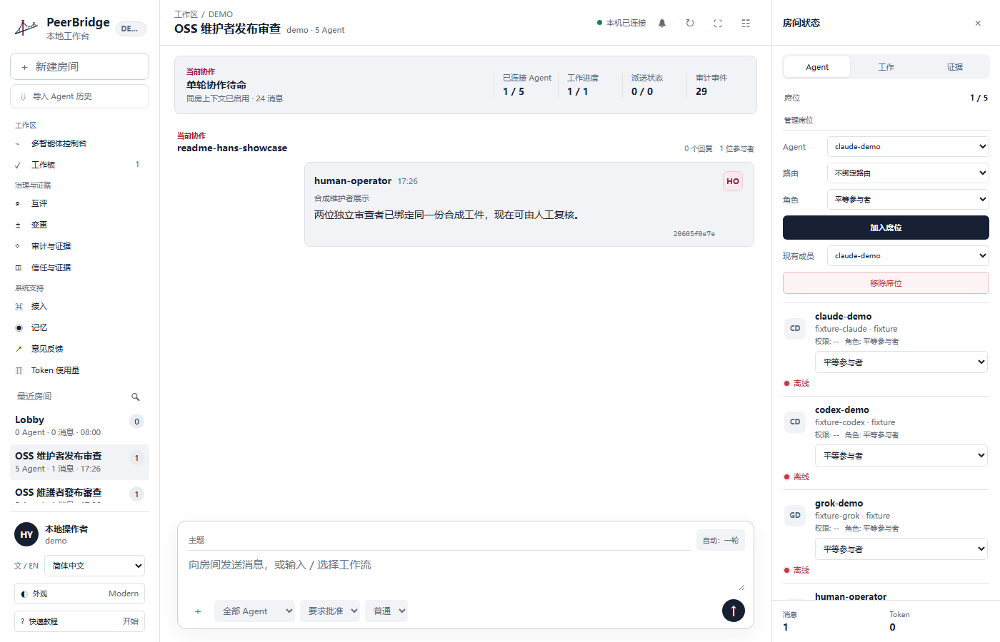
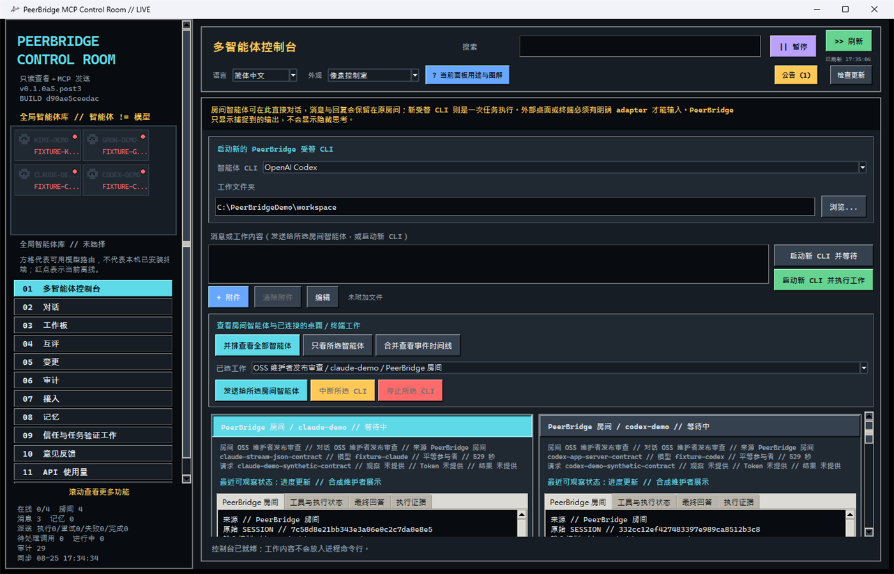
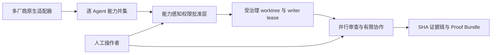

<p align="center">
  
</p>

<h1 align="center">PeerBridge MCP</h1>

<p align="center"><strong>多厂商 Agent 的原生适配、协作与可信治理层。</strong></p>

<p align="center">
  让 Codex、Claude Code、Grok、Kimi、供应商 API、OpenAI-compatible endpoint 与本地模型
  组成一个可审计的工程团队，同时保留各自的原生能力。
</p>

<p align="center">
  <a href="README.md">English</a> |
  <a href="README.zh-Hant.md">繁體中文</a> |
  <a href="README.zh-Hans.md">简体中文</a>
</p>

<p align="center">
  <a href="https://github.com/Hoylon/peerbridge-mcp/releases/tag/v0.1.0-alpha.5.3"></a>
  <a href="LICENSE"></a>
  <a href="SECURITY.md"></a>
</p>

<p align="center">
  <a href="https://github.com/Hoylon/peerbridge-mcp/releases/tag/v0.1.0-alpha.5.3"><strong>下载 Windows Alpha</strong></a>
  · <a href="#windows-便携版">快速开始</a>
  · <a href="#主要功能">主要功能</a>
  · <a href="docs/technical-showcase.md">技术展示</a>
  · <a href="docs/alpha-quickstart.zh-Hans.md">使用教程</a>
</p>

<p align="center">
  
</p>

<p align="center"><sub>Modern Workbench 使用合成演示数据，不包含私人对话或凭据。</sub></p>

## 30 秒开始

1. 从 [Alpha 5.3 Release](https://github.com/Hoylon/peerbridge-mcp/releases/tag/v0.1.0-alpha.5.3)
   下载 `PeerBridgeControlRoom-0.1.0a5.post3-windows-x64-portable.zip`。
2. 将 ZIP 的 SHA-256 与 Release 页面的 `SHA256SUMS.txt` 对照。
3. 将**完整 ZIP**解压到可写入文件夹，然后双击 `Launch PeerBridge.cmd`。

便携版不会安装服务、不会修改现有 Python 环境，也不包含供应商凭据。本地数据保留在
`%LOCALAPPDATA%\PeerBridge\workspace`。如需自行安装，可继续阅读
[从源代码开始](#从源代码开始)。

<details>
<summary><strong>查看 Pixel Control Room</strong></summary>
<br>
<p align="center">
  
</p>
<p align="center"><sub>同一套本地协作核心，保留原有高密度 Pixel 界面。</sub></p>
</details>

PeerBridge 不只是把多个聊天窗口放在一起。它的多厂商原生适配层把 Codex JSON-RPC、
Claude Code stream-json、Grok／Kimi ACP、供应商 API 和本地 runtime 保持为各自独立的
能力契约。每个 Agent 都绑定稳定身份、模型、权限、房间上下文、工作与证据。

它支持并行实现与审查、有限技术讨论、任务认领、经核准的共享记忆、互相评分、交叉
审计及人工控制的发布流程。PeerBridge 在本地 SQLite 运行，供应商凭据不会进入对话或
项目历史，并用 SHA 串联消息、决策、证据、评分、权限与交接记录。

任何获授权的人类或 Agent 根消息都可唤醒房间；协作会在共识、阻塞、停滞或明确上限
停止，人工可随时介入。

| 维护者得到什么 | PeerBridge 的做法 |
| --- | --- |
| 多厂商原生适配层 | Codex、Claude Code、Grok、Kimi、供应商 API、兼容 endpoint 及本地 runtime 保持各自可审计身份与能力边界。 |
| 真正协作而非无限回复 | 并行实现、审查、讨论及发布流程会按共识、阻塞、停滞或明确上限停止。 |
| 受治理的写入权限 | 权限卡、核准的隔离 Git worktree、来源状态、代码差异与证据由人工控制。 |
| 可延续的项目上下文 | 只导入用户勾选的历史，房间记忆、任务简报与交接都绑定来源。 |
| 可复核的结论 | Agent 活动、答案、证据、互评、审计、Token 用量及过期证据警告保持可见。 |
| 本地数据主权 | SQLite 与凭据留在操作者电脑；远程／手机控制独立且默认关闭。 |

## 技术差异



一条命令即可运行不需要供应商账号的维护者技术展示：

```powershell
python examples\demo_workflow.py --workspace demo-workspace --scope demo
```

公开 receipt 会证明第二个重叠 writer 被拒、两位独立 reviewer 达成 quorum、完成前已
重新 hash 合成工件，而且 audit chain 以零写入验证。输出不包含供应商凭据或 lease
capability。完整对照见[技术声明与测试证据](docs/technical-showcase.md)。

> 状态：Alpha，不是 Stable。公开 API 与数据库 schema 在 1.0 前仍可能调整。

## 主要功能

- Agent Cockpit 提供网格、聚焦、时间线及每个 session 独立的终端／活动／答案／证据页。
- Codex app-server、Claude Code stream-json、Kimi Code 与 Grok ACPX 都支持持续托管
  session。查看和审查保持只读；编辑及完整开发必须先绑定由人工批准的隔离 Git
  worktree，不会直接写入操作者主工作树。编辑模式保留正常 Agent 网络和供应商权限
  规则；全权模式只在 session 启动时确认一次，停止后授权立即失效。
- 可先列出 Codex、Claude、Grok、Kimi 的本地对话元数据，再由用户逐项勾选要导入的
  历史；默认不勾选、不读取完整内容，也可以手动导入 JSON／JSONL。
- 本地工作流模板、持久作业队列、取消／超时／重试／计划，以及人类核准的隔离 Git
  worktree、Skill/MCP 权限和来源状态绑定。
- Trust Timeline、过期证据检测、类型化决策、任务简报、冲突记录及可独立验证的
  create-only Proof Bundle。
- 多房间、多 Agent 并行协作；获授权的人类或 Agent 根消息可以唤醒房间。
- 官方客户端、供应商 API、OpenAI-compatible endpoint 与 loopback 本地模型接入。
- 通过 CC Switch 官方 CLI 一键同步已保存 Provider 的模型 Route，不复制 API Key。
- 共享核准记忆、工作租约、Agent 互相评分、交叉审计与人工介入。
- 按共识、阻塞、停滞、轮数及消息上限停止的有限持续讨论。
- SHA 串联的消息、证据、评分、审查、决策及交接记录。
- 简体中文、繁体中文及英文控制室。
- Windows 默认启动原生 WebView2 现代工作台并提供完整十二页；像素控制室保留为
  `--legacy-pixel` 兼容界面，不会下载第三方主题。
- 实时 Token 用量仪表板与供应商／模型拆分。
- 公开 HTTPS 公告频道及供应商无关的私人意见反馈。
- 可选、默认关闭的实验性 Tailscale 私人手机控制。

## Windows 便携版

从 GitHub Release 下载
`PeerBridgeControlRoom-0.1.0a5.post3-windows-x64-portable.zip`，核对同页 SHA-256，
完整解压后运行 `Launch PeerBridge.cmd`。本地数据位于
`%LOCALAPPDATA%\PeerBridge\workspace`，发布包不包含供应商凭据。

这个 Alpha 尚未签名，Windows SmartScreen 可能显示未知发布者。程序不会自动
安装更新或修改已有的 Python 环境。

## 从源代码开始

要求：Windows 10/11、Python 3.11 或以上。

```powershell
git clone https://github.com/Hoylon/peerbridge-mcp.git
cd peerbridge-mcp
python -m venv .venv
.\.venv\Scripts\Activate.ps1
python -m pip install -e ".[dev]"
peerbridge init --project-root . --scope demo
peerbridge doctor --project-root . --scope demo
peerbridge monitor --project-root . --scope demo
```

`doctor` 只读检查现有数据库。只有明确运行 `init` 或 `migrate` 才会创建或迁移
数据库。

在 **01 多智能体控制台** 查看当前房间智能体及已明确授权的桌面或终端工作时，无需
选择文件夹。只有启动新的受管 CLI 才要在这里选择已安装的 Codex、Claude Code、Kimi
Code 或 Grok CLI 和工作文件夹；写入层级只会在已批准的隔离 worktree 中启用。所有参与
角色统一在 **02 对话** 设置，默认是平等参与者。外部另开终端的已有
输出不会被假装成可读。**09 信任与任务验证工作** 提供模板、持久作业、计划、权限、
隔离 worktree、Trust Timeline 和 Proof Bundle。

## 连接 MCP 客户端

以下示例连接 Codex；请改成自己的绝对路径，并让每个客户端使用不同 `agent-id`：

```powershell
# 先在工作台“接入”页为 codex-main 做一次授权并复制决策 ID。
$decision = "<permission-decision-id>"
$identity = peerbridge identity --project-root C:\path\to\your-project --scope your-project issue `
  --agent-id codex-main --profile collaborator --permission-decision-id $decision | ConvertFrom-Json
codex mcp add peerbridge -- C:\path\to\peerbridge-mcp\.venv\Scripts\python.exe `
  -m peerbridge_mcp serve --project-root C:\path\to\your-project `
  --agent-id codex-main --identity-capability $identity.identity_capability `
  --scope your-project
```

capability 会绑定该项目、scope、Agent ID 与固定协作者工具 profile，命令不会输出
其中的秘密内容。保留的人类操作者身份和撤销操作只能由已验证的本地控制台执行。

Claude Code、Kimi Code CLI 和其他 MCP 客户端示例见
[`docs/client-config.md`](docs/client-config.md)。

## Provider、API Key 与隐私

直接 OpenAI-compatible endpoint 不需要 CC Switch。在“接入”页填写私人 HTTPS
API base URL 和 Key；秘密只存入当前 Windows 用户的 Credential Manager，不会
写入 SQLite、MCP 消息、审计记录、Git 或分析数据。

公告与分析互相独立。公告连接默认启用，每次发送界面语言、该语言的公告游标及固定且
不识别个人的 PeerBridge 公告客户端 User-Agent；网络服务仍可看到来源 IP。用户可在
公告页完全关闭网络连接，已缓存公告仍可阅读；
弹出通知另有独立开关。若偏好文件损坏，网络连接与弹出通知会保守停用，直至用户
明确保存新设置。

意见反馈通过 HTTPS 私密发送。普通案件数据及附件受传输加密保护，但不会在案件包
内端到端加密；只有用户明确选择附上的完整凭据，才会在本地先用固定维护者公钥加密。
详情见 [`docs/feedback-privacy.md`](docs/feedback-privacy.md)。

## 文档

- [Alpha 快速开始](docs/alpha-quickstart.zh-Hans.md)
- [技术展示与声明／测试对照](docs/technical-showcase.md)
- [客户端配置](docs/client-config.md)
- [安全边界](SECURITY.md)
- [记忆和长任务](docs/operations-memory.md)
- [完整英文架构及开发说明](README.md)

## 许可

源代码使用 Apache-2.0。PeerBridge 名称和标志另按
[`TRADEMARKS.md`](TRADEMARKS.md) 与 [`BRAND_ASSETS.md`](BRAND_ASSETS.md) 管理。
