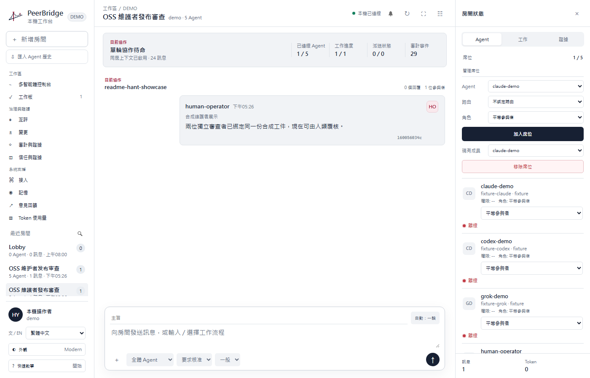
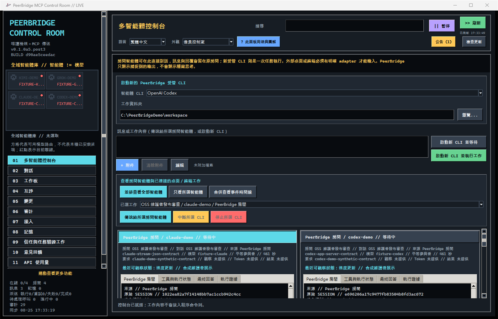
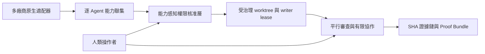

<p align="center">
  
</p>

<h1 align="center">PeerBridge MCP</h1>

<p align="center"><strong>多廠商 Agent 的原生適配、協作與可信治理層。</strong></p>

<p align="center">
  讓 Codex、Claude Code、Grok、Kimi、供應商 API、OpenAI-compatible endpoint 與本機模型
  組成一個可稽核的工程團隊，同時保留各自的原生能力。
</p>

<p align="center">
  <a href="README.md">English</a> |
  <a href="README.zh-Hant.md">繁體中文</a> |
  <a href="README.zh-Hans.md">简体中文</a>
</p>

<p align="center">
  <a href="https://github.com/Hoylon/peerbridge-mcp/releases/tag/v0.1.0-alpha.5.4"></a>
  <a href="LICENSE"></a>
  <a href="SECURITY.md"></a>
</p>

<p align="center">
  <a href="https://github.com/Hoylon/peerbridge-mcp/releases/tag/v0.1.0-alpha.5.4"><strong>下載 Windows Alpha</strong></a>
  · <a href="#windows-可攜版">快速開始</a>
  · <a href="#主要功能">主要功能</a>
  · <a href="docs/technical-showcase.md">技術展示</a>
  · <a href="docs/alpha-quickstart.zh-Hant.md">使用教學</a>
</p>

<p align="center">
  
</p>

<p align="center"><sub>Modern Workbench 使用合成示範資料，不包含私人對話或憑證。</sub></p>

## 30 秒開始

1. 從 [Alpha 5.4 Release](https://github.com/Hoylon/peerbridge-mcp/releases/tag/v0.1.0-alpha.5.4)
   下載 `PeerBridgeControlRoom-0.1.0a5.post4-windows-x64-portable.zip`。
2. 把 ZIP 的 SHA-256 與 Release 頁面的 `SHA256SUMS.txt` 比對。
3. 把**完整 ZIP**解壓到可寫入資料夾，然後雙擊 `Launch PeerBridge.cmd`。

可攜版不會安裝服務、不會修改既有 Python 環境，亦不包含供應商憑證。本機資料保留在
`%LOCALAPPDATA%\PeerBridge\workspace`。偏好自行安裝可繼續閱讀
[從原始碼開始](#從原始碼開始)。

<details>
<summary><strong>查看 Pixel Control Room</strong></summary>
<br>
<p align="center">
  
</p>
<p align="center"><sub>同一套本機協作核心，保留原有高密度 Pixel 介面。</sub></p>
</details>

PeerBridge 不只是把多個聊天視窗放在一起。它的多廠商原生適配層把 Codex JSON-RPC、
Claude Code stream-json、Grok／Kimi ACP、供應商 API 及本機 runtime 保持為各自獨立的
能力契約。每個 Agent 都綁定穩定身分、模型、權限、房間上下文、工作與證據。

它支援平行實作與審查、有限技術討論、工作認領、經核准的共享記憶、互相評分、交叉
審計及人類控制的發布流程。PeerBridge 在本機 SQLite 執行，供應商憑證不會進入對話或
專案歷史，並以 SHA 串接訊息、決策、證據、評分、權限與交接記錄。

任何獲授權的人類或 Agent 根訊息都可喚醒房間；協作會在共識、阻塞、停滯或明確上限
停止，人類可隨時介入。

| 維護者得到什麼 | PeerBridge 的做法 |
| --- | --- |
| 多廠商原生適配層 | Codex、Claude Code、Grok、Kimi、供應商 API、相容 endpoint 及本機 runtime 保持各自可稽核身分與能力邊界。 |
| 真正協作而非無限回覆 | 平行實作、審查、討論及發布流程會按共識、阻塞、停滯或明確上限停止。 |
| 受治理的寫入權限 | 權限卡、核准的隔離 Git worktree、來源狀態、程式碼差異與證據由人類控制。 |
| 可延續的專案上下文 | 只匯入使用者勾選的歷史，房間記憶、任務簡報與交接均綁定來源。 |
| 可覆核的結論 | Agent 活動、答案、證據、互評、審計、Token 用量及過期證據警告保持可見。 |
| 本機資料主權 | SQLite 與憑證留在操作者電腦；遠端／手機控制獨立且預設關閉。 |

## 技術差異



一條命令即可執行不需供應商帳號的維護者技術展示：

```powershell
python examples\demo_workflow.py --workspace demo-workspace --scope demo
```

公開 receipt 會證明第二個重疊 writer 被拒、兩位獨立 reviewer 達成 quorum、完成前已
重新 hash 合成工件，且 audit chain 以零寫入驗證。輸出不包含供應商憑證或 lease
capability。完整對照見[技術聲明與測試證據](docs/technical-showcase.md)。

> 狀態：Alpha，不是 Stable。公開 API 與資料庫 schema 在 1.0 前仍可能調整。

## 主要功能

- Agent Cockpit 提供網格、聚焦、時間線及每個 session 獨立的終端／活動／答案／證據頁。
- Codex app-server、Claude Code stream-json、Kimi Code 與 Grok ACPX 均支援持續受管
  session。檢視與審查保持唯讀；編輯及完整開發必須先綁定由人類批准的隔離 Git
  worktree，不會直接寫入操作者主工作樹。編輯模式保留正常 Agent 網絡及供應商權限
  規則；全權模式只在 session 開始時確認一次，停止後授權立即失效。
- 可先列出 Codex、Claude、Grok、Kimi 的本機對話 metadata，再由使用者逐項勾選要
  匯入的歷史；預設不勾選、不讀完整內容，亦可手動匯入 JSON／JSONL。
- 本機工作流模板、持久作業佇列、取消／逾時／重試／排程，以及人類核准的隔離 Git
  worktree、Skill/MCP 權限與來源狀態綁定。
- Trust Timeline、過期證據偵測、類型化決策、任務簡報、衝突記錄及可獨立驗證的
  create-only Proof Bundle。
- 多房間、多 Agent 平行協作；獲授權的人類或 Agent 根訊息可喚醒房間。
- 官方客戶端、供應商 API、OpenAI-compatible endpoint 與 loopback 本機模型接入。
- 透過 CC Switch 官方 CLI 一鍵同步已保存 Provider 的模型 Route，不複製 API Key。
- 共享核准記憶、工作租約、Agent 互相評分、交叉審計與人工介入。
- 按共識、阻塞、停滯、輪數及訊息上限停止的有限持續討論。
- SHA 串接的訊息、證據、評分、審查、決策及交接記錄。
- 繁體中文、簡體中文及英文控制室。
- Windows 預設啟動原生 WebView2 現代工作台並提供完整十二頁；像素控制室保留為
  `--legacy-pixel` 相容介面，不會下載第三方主題。
- 即時 Token 用量儀表板與供應商／模型拆分。
- 公開 HTTPS 公告頻道及供應商無關的私人意見回饋。
- 可選、預設關閉的實驗性 Tailscale 私人手機控制。

## Windows 可攜版

從 GitHub Release 下載
`PeerBridgeControlRoom-0.1.0a5.post4-windows-x64-portable.zip`，核對同頁 SHA-256，
完整解壓後執行 `Launch PeerBridge.cmd`。本機資料位於
`%LOCALAPPDATA%\PeerBridge\workspace`，發佈包不包含供應商憑證。

這個 Alpha 尚未簽署，Windows SmartScreen 可能顯示未知發布者。程式不會自動
安裝更新或修改既有 Python 環境。

## 從原始碼開始

需求：Windows 10/11、Python 3.11 或以上。

```powershell
git clone https://github.com/Hoylon/peerbridge-mcp.git
cd peerbridge-mcp
python -m venv .venv
.\.venv\Scripts\Activate.ps1
python -m pip install -e ".[dev]"
peerbridge init --project-root . --scope demo
peerbridge doctor --project-root . --scope demo
peerbridge monitor --project-root . --scope demo
```

`doctor` 只讀檢查既有資料庫。只有明確執行 `init` 或 `migrate` 才會建立或遷移
資料庫。

在 **01 多智能體控制台** 查看目前房間智能體及已明確授權的桌面或終端工作時，不用
選擇資料夾。只有啟動新的受管 CLI 才要在這裡選已安裝的 Codex、Claude Code、Kimi
Code 或 Grok CLI 與工作資料夾；寫入層級只會在已批准的隔離 worktree 中啟用。所有參與
角色統一在 **02 對話** 設定，預設為平等參與者。外部另開終端的既有
輸出不會被假裝成可讀。**09 信任與任務驗證工作** 提供模板、持久作業、排程、權限、
隔離 worktree、Trust Timeline 與 Proof Bundle。

## 連接 MCP 客戶端

以下例子連接 Codex；請改成自己的絕對路徑，且每個客戶端使用不同 `agent-id`：

```powershell
# 先在工作台「接入」頁為 codex-main 做一次授權並複製決策 ID。
$decision = "<permission-decision-id>"
$identity = peerbridge identity --project-root C:\path\to\your-project --scope your-project issue `
  --agent-id codex-main --profile collaborator --permission-decision-id $decision | ConvertFrom-Json
codex mcp add peerbridge -- C:\path\to\peerbridge-mcp\.venv\Scripts\python.exe `
  -m peerbridge_mcp serve --project-root C:\path\to\your-project `
  --agent-id codex-main --identity-capability $identity.identity_capability `
  --scope your-project
```

capability 會綁定該專案、scope、Agent ID 與固定協作者工具 profile，命令不會輸出
其中的秘密內容。保留的人類操作者身分及撤銷操作只可由已驗證的本機控制台執行。

Claude Code、Kimi Code CLI 及其他 MCP 客戶端例子見
[`docs/client-config.md`](docs/client-config.md)。

## Provider、API Key 與私隱

直接 OpenAI-compatible endpoint 不需要 CC Switch。在「接入」頁填寫私人 HTTPS
API base URL 與 Key；秘密只存入目前 Windows 使用者的 Credential Manager，不會
寫入 SQLite、MCP 訊息、稽核記錄、Git 或分析資料。

公告與分析互相獨立。公告連線預設啟用，每次送出介面語言、該語言的公告游標及固定且
不識別個人的 PeerBridge 公告客戶端 User-Agent；網絡服務仍可看到來源 IP。使用者可在
公告頁完全關閉網絡連線，已緩存公告仍可閱讀；
彈出通知另有獨立開關。若偏好檔案損壞，網絡連線與彈出通知會保守停用，直至使用者
明確儲存新設定。

意見回饋透過 HTTPS 私密送出。一般案件資料及附件受傳輸加密保護，但不會在案件包
內端對端加密；只有使用者明確選擇附上的完整憑證，才會在本機先以固定維護者公鑰
加密。詳情見 [`docs/feedback-privacy.md`](docs/feedback-privacy.md)。

## 文件

- [Alpha 快速開始](docs/alpha-quickstart.zh-Hant.md)
- [技術展示與聲明／測試對照](docs/technical-showcase.md)
- [客戶端設定](docs/client-config.md)
- [安全界線](SECURITY.md)
- [記憶及長任務](docs/operations-memory.md)
- [完整英文架構及開發說明](README.md)

## 授權

原始碼使用 Apache-2.0。PeerBridge 名稱及標誌另按
[`TRADEMARKS.md`](TRADEMARKS.md) 與 [`BRAND_ASSETS.md`](BRAND_ASSETS.md) 管理。
