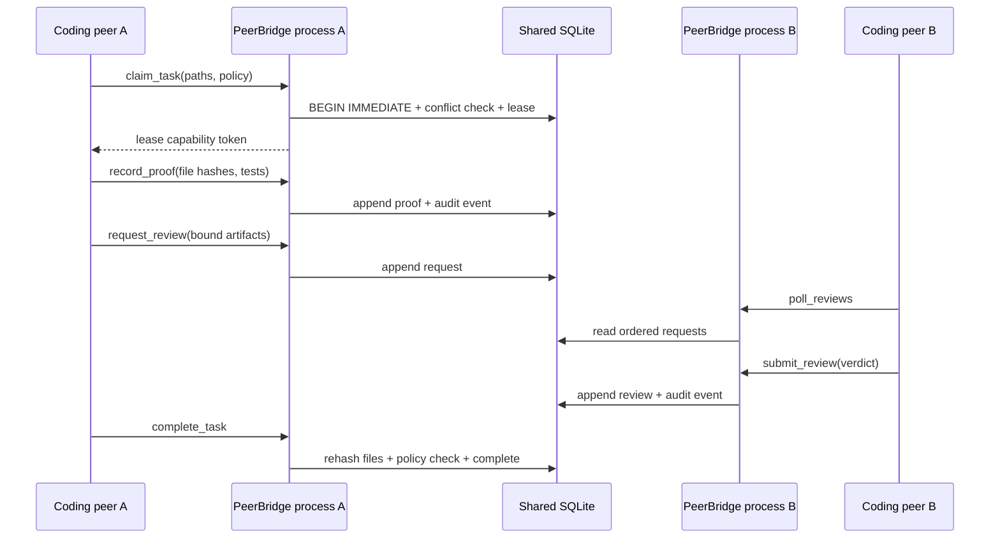

# Architecture

## Components

PeerBridge MCP has four small layers:

1. `protocol.py` formats MCP and JSON-RPC responses.
2. `server.py` exposes the stdio MCP tool catalog and dispatches calls.
3. `bridge.py` implements validation, coordination rules, SQLite transactions, and hashes.
4. `monitor.py` reads the shared store and sends explicit human messages through stdio.

There is no long-running central network daemon. Each MCP client starts an independent
stdio process. All processes point to the same project-local database.

Additional peers repeat the PB2 pattern with their own `--agent-id`. The store does not
have a hard-coded agent count. A task may request one named peer, use presence-aware
fallback, or require an explicit approval quorum from a configured peer set.

Presence also records non-secret runtime labels for the MCP client, provider route, and
selected model. These labels distinguish, for example, an official Grok route from a
relay-provided Grok route without storing credentials or claiming upstream equivalence.

## State model

### Messages

Every message has a monotonic database sequence, a unique ID, a scope, sender, recipient,
task ID, content SHA-256, and optional artifact bindings. Receipts are keyed by message and
consumer. A consumer cursor advances only across its contiguous acknowledged messages.

### Tasks and leases

A task declares read and write path prefixes. Read/read overlap is allowed. Any overlap
involving a write path conflicts while the other lease is live. A random capability token
is returned once; only its SHA-256 is stored. Expired leases are reopened transactionally.

### Reviews

Review requests bind project-relative artifact paths and their live hashes. A peer verdict
is recorded separately from the request. A review does not apply code and does not grant
shell authorization. `quorum_required` counts distinct approved reviewers from the task's
configured `required_peers`; repeated reviews by one identity cannot satisfy extra votes.

### Proof and completion

The writer records changed paths, before hashes when known, current after hashes, tests,
and evidence paths. `complete_task` rehashes those files and fails if they drifted. It then
evaluates the configured approval policy and closes the lease atomically.

### Audit chain

Each state transition appends an event whose chain hash includes its payload hash, previous
chain hash, scope, actor, task, type, ID, and timestamp. The verifier recalculates every
link. The database remains the trust root unless its head is externally anchored.

## Concurrency

- SQLite uses WAL mode for concurrent readers.
- Mutating operations use explicit transactions and `BEGIN IMMEDIATE` where ordering is
  important.
- Leases are capability based and time bounded.
- Path comparisons normalize project-relative paths and reject traversal.
- One MCP process represents one agent session; presence expires if heartbeats stop.

## Protocol compatibility

PeerBridge is dual-era:

- Legacy MCP clients use `initialize`, `notifications/initialized`, `tools/list`, and
  `tools/call`.
- Modern MCP `2026-07-28` clients can probe with `server/discover` and carry protocol,
  client identity, and capabilities in request `_meta`.

The coordination task model is application state. It is not an implementation of the MCP
Tasks extension.
