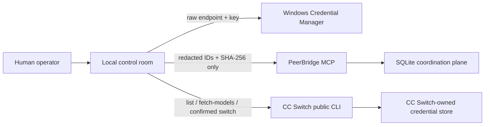
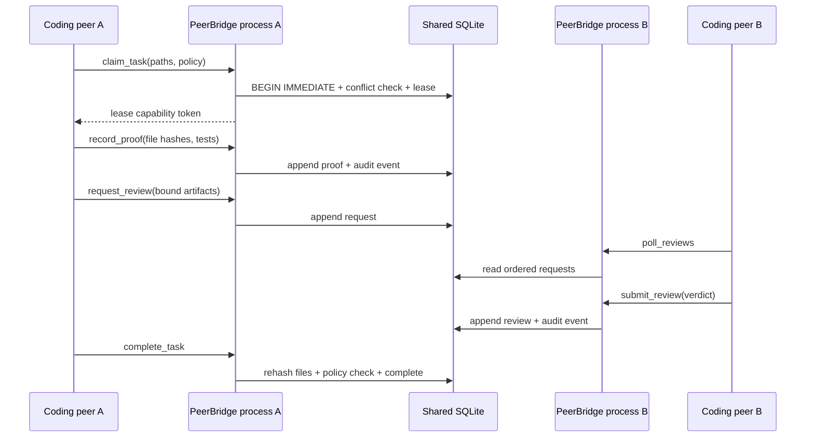

# Architecture

## Components

PeerBridge MCP has nine small layers:

1. `protocol.py` formats MCP and JSON-RPC responses.
2. `server.py` exposes the stdio MCP tool catalog and dispatches calls.
3. `bridge.py` implements validation, rooms, reusable Agent identities, coordination rules,
   SQLite transactions, and hashes.
4. `monitor.py` reads the shared store, sends explicit human messages through stdio,
   and provides the local safe-connections UI.
5. `credentials.py` keeps raw provider credentials in Windows Credential Manager.
6. `ccswitch.py` uses CC Switch's public CLI without reading its database.
7. `remote.py` provides a loopback-only, scope-bound human page intended solely for an
   authenticated Tailscale Serve proxy.
8. `openai_compatible_runner.py` provides a bounded, receipt-producing adapter for
   OpenAI-compatible relay or local model APIs and a least-privilege MCP tool loop.
9. `attachments.py` validates explicit local selections and stages content-addressed,
   release-ignored evidence without persisting the original private path or filename.

There is no required central network daemon. Each MCP client starts an independent stdio
process and points to the same project-local database. Private mobile mode adds one
optional long-running loopback web process; it is not an MCP-over-HTTP transport.

### Private mobile path

Tailscale Serve is the only supported remote proxy. It terminates private tailnet HTTPS
and forwards to `127.0.0.1`. The remote process compares the injected login against an
allowlist, scopes reads in SQL, and converts a human write into a short-lived stdio MCP
`send_message` call. Provider secrets and private endpoints never enter that path.

Provider onboarding has a separate data path:

Raw credentials never follow the MCP/SQLite path. A saved route is selected in the
order Agent -> provider connection -> model -> reasoning setting supported by that
exact model. Broadcast messages deliberately bypass model routing because multiple
recipients cannot share one verifiable runtime identity.

Additional peers repeat the PB2 pattern with their own `--agent-id`. The store does not
have a hard-coded agent count. A task may request one named peer, use presence-aware
fallback, or require an explicit approval quorum from a configured peer set.

Presence also records non-secret runtime labels for the MCP client, provider route,
selected model, and reasoning mode. These labels distinguish, for example, an official
Grok route from a relay-provided Grok route without storing credentials or claiming
upstream equivalence.

## State model

### Messages

Every message has a monotonic database sequence, a unique ID, a scope, room, sender,
recipient, task ID, content SHA-256, and optional artifact bindings. The room ID is part of
the v2 content hash. Discussion messages additionally bind discussion ID, round, and role
in the v3 content hash. Receipt verification accepts historical v1 and v2 contracts without
rewriting them. Receipts are keyed by message and consumer. A consumer cursor advances only
across its contiguous acknowledged messages inside that room.

Desktop-selected attachments are copied to `.peerbridge-artifacts/chat/` under a SHA-256
filename after type, signature, size, symlink, and credential-pattern validation. The
directory is protected from task write scopes and excluded from release snapshots. Initial
parallel prompts bind the relative path once; continuation prompts discuss prior responses
without repeatedly adding the same payload.

A message may bind a route profile or explicit provider/model/reasoning request. The
request is included in the message content hash. It starts as `requested`; a recipient
can acknowledge it only when the session's observed identity matches every requested
field. Successful acknowledgement writes a separate route receipt containing the exact
session and observed identity. Route profiles are mutable convenience records, while
each message embeds the resolved values and remains independently verifiable.

### Global Agents and room seats

The global Agent catalog is derived from presence, route profiles, historical messages, and
room membership. It remains visible when an Agent is offline or leaves every room. A room
seat references that global identity and stores an independent `room_session_id`, route
profile, join/leave timestamps, status, and membership SHA-256. One global Agent may hold
one seat in each of many rooms without being moved between them.

Leaving a room changes only that room's seat to `left`; it never deletes the Agent, messages,
receipts, or audit events. Rejoining creates a new room session. Replies are rejected when
their parent belongs to another room, and a non-member cannot poll or receive directed
messages from a non-Lobby room. Collaboration receipt v2 binds one complete chain to one
room; historical v1 receipts remain independently verifiable.

### Bounded room automation

Every room, including Lobby, owns one SHA-bound policy: automation off, one parallel
response round, or bounded parallel discussion. Discussion state records the current and
processed rounds, message count, limits, stagnation digest, status, and stop reason.

Room chat and governance review are deliberately separate. `post_room_message` is the
only human/Agent root-post path that wakes every other active Seat with an explicit route.
`request_review` only appends a source-bound manual review request for `poll_reviews`; it
does not invoke a provider. The monitor therefore renders open requests on Review rather
than mixing them into the chat timeline. Provider replies are direct child messages and
never become new root posts, preventing reply cascades.

The supervisor claims only top-level coordinator prompts. Model replies are evidence for
the coordinator, not new dispatch triggers. Once every prompt in a round completes or
fails, one immediate transaction creates the next parallel prompt set or stops for
consensus, blockers, dispatch failure, repeated content, a round limit, or a message limit.
If a configured seat has no usable credential at dispatch time, the supervisor claims that
seat's exact route-bound prompt and records a terminal `credential_unavailable` result.
The discussion then enters `waiting_human` with `agent_dispatch_failed` instead of remaining
active forever. The unavailable provider is not advertised as online, and a later human
continue can re-probe the route after its credential is restored.
The single supervisor claims the whole available round before running its provider calls
through a bounded parallel executor, then advances the state once after all calls return.
The human operator can pause/resume an in-flight round, continue after a bounded stop, or
stop the active state.

### Provider-neutral Memory Ledger

Memory is an explicit shared record, not a copy of a model's hidden state. All providers
use the same schema, so a source-bound fact written by one client can be read by another
without pretending that their internal conversation histories are compatible.

| Visibility | Writer | Reader | Boundary |
| --- | --- | --- | --- |
| `private` | Owning Agent | Owning Agent | One room and one owner |
| `room` | Active room member | Active room members | One room |
| `project` | `human-operator` | All project peers | Explicit human promotion |

Room and Private records require a room ID. Project records require a source message,
parent memory, or project artifact, and the stored row binds the live source SHA-256.
Cross-room source promotion is rejected unless the human explicitly creates Project memory.
Revocation marks a record inactive and appends a revocation hash and audit event; it never
rewrites or deletes the original row. Provider-neutral runners receive read-only memory
tools by default and receipts record only tool names and hashes, never memory bodies.

### Tasks and leases

A task declares read and write path prefixes. Read/read overlap is allowed. Any overlap
involving a write path conflicts while the other lease is live. A random capability token
is returned once; only its SHA-256 is stored. Expired leases are reopened transactionally.

### Reviews

Review requests bind project-relative artifact paths and their live hashes. A peer verdict
is recorded separately from the request. A review does not apply code and does not grant
shell authorization. `quorum_required` counts distinct approved reviewers from the task's
configured `required_peers`; repeated reviews by one identity cannot satisfy extra votes.

### Proof and completion

The writer records changed paths, before hashes when known, current after hashes, tests,
and evidence paths. `complete_task` rehashes those files and fails if they drifted. It then
evaluates the configured approval policy and closes the lease atomically.

### Audit chain

Each state transition appends an event whose chain hash includes its payload hash, previous
chain hash, scope, actor, task, type, ID, and timestamp. The verifier recalculates every
link. The database remains the trust root unless its head is externally anchored.

## Concurrency

- SQLite uses WAL mode for concurrent readers.
- Mutating operations use explicit transactions and `BEGIN IMMEDIATE` where ordering is
  important.
- Leases are capability based and time bounded.
- Path comparisons normalize project-relative paths and reject traversal.
- One MCP process represents one agent session; presence expires if heartbeats stop.

## Protocol compatibility

PeerBridge is dual-era:

- Legacy MCP clients use `initialize`, `notifications/initialized`, `tools/list`, and
  `tools/call`.
- Modern MCP `2026-07-28` clients can probe with `server/discover` and carry protocol,
  client identity, and capabilities in request `_meta`.

The coordination task model is application state. It is not an implementation of the MCP
Tasks extension.
