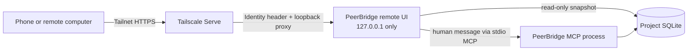

# Private remote and mobile control

PeerBridge can expose a narrow human control page to devices in the same Tailscale
tailnet without renting a server. This is **not** a public MCP endpoint and it is not a
multi-tenant cloud service.

## Data path



The Python backend refuses every non-loopback bind. Tailscale Serve terminates HTTPS,
authenticates the tailnet user, and injects `Tailscale-User-Login`. PeerBridge compares
that identity against an allowlist. Every API request must also carry a separate 256-bit
launcher credential. The backend receives it through a child-process environment variable,
stores only its SHA-256, and never accepts it as a command-line argument. It persists only a
SHA-derived human agent ID and never writes the raw login to SQLite or the audit chain.

The page can:

- inspect scope-bound messages, tasks, registered routes, providers, and agent presence;
- send an explicit human message through the same MCP `send_message` tool as the desktop
  control room.

It cannot run a shell, read arbitrary files, edit provider credentials, apply a patch,
claim a task, approve a review, or modify project files.

## Start on Windows

Requirements:

1. PeerBridge is installed into the repository's `.venv`.
2. Tailscale is signed in on the always-on PC.
3. The phone or remote computer is signed into the same tailnet.
4. MagicDNS and HTTPS certificates are enabled for the tailnet. Tailscale requires a
   tailnet administrator to acknowledge that the machine and tailnet DNS names become
   public certificate-transparency metadata.

The launcher fails closed before starting PeerBridge when `tailscale status --json`
reports no certificate domain. This avoids an indefinite first-run consent prompt and
leaves no loopback backend running. Enable HTTPS once in the Tailscale admin DNS page,
then rerun the launcher.

Run:

```powershell
.\scripts\launch_remote_control.cmd -Port 8765 -Scope your-project
```

The launcher starts a hidden loopback process, waits for `/healthz`, and configures
Tailscale Serve. It writes the complete private URL, including a browser-only URL-fragment
credential, to `.peerbridge/remote-control-access-url.txt`. Windows ACLs restrict that file
to the current operating-system account. Copy the URL from that file to the phone; do not
paste it into logs, issues, screenshots, or release evidence. The browser removes the
fragment from its address bar and keeps it in session storage while sending a dedicated
authorization header to the API. Do not use Tailscale Funnel; Funnel is public internet
exposure and is outside this design.

By default, only the owner identity of the local Tailscale node is authorized. Advanced
operators can launch `peerbridge remote` directly with repeated `--allow-login` values.
The values remain process configuration; PeerBridge does not persist them.

## Security controls

- loopback-only backend and tailnet-only HTTPS proxy;
- exact Tailscale login allowlist;
- independent 256-bit private-link credential on every API call, with only its SHA-256
  retained by the backend;
- access URL stored in a current-user-only Windows ACL file and never placed in process
  arguments, SQLite, Serve state, or logs;
- per-process CSRF token and strict HTTPS same-origin checks;
- JSON and field allowlists, 64 KiB request limit, 20,000-character message limit;
- 12 human writes per identity per minute;
- ten-second socket timeout and connection close after each response;
- no-store, CSP, frame denial, referrer denial, and browser permission denial headers;
- scope filtering in SQLite before row limits are applied;
- credential-pattern rejection before the MCP write path;
- raw provider endpoints, credential targets, and credential fingerprints excluded from
  the remote snapshot;
- all writes use the existing MCP schema validation and SHA-linked audit chain.

Forging the Tailscale identity header alone is insufficient: the independent private-link
credential is also required. A process running as the same local operating-system account
can still read that account's protected URL file or process memory, so the local account
remains a trusted boundary. Other non-administrator operating-system accounts do not
receive access through loopback-header forgery. Do not run untrusted software under the
PeerBridge account.

Official Tailscale references:

- [Tailscale Serve](https://tailscale.com/docs/features/tailscale-serve)
- [Tailscale Funnel](https://tailscale.com/docs/features/tailscale-funnel)

## Verification

Before relying on remote access, run:

```powershell
.\.venv\Scripts\python.exe -m pytest -q tests\test_remote.py
.\.venv\Scripts\python.exe -m peerbridge_mcp doctor `
  --project-root . --db .peerbridge\live.sqlite3 --scope your-project
```

The automated tests cover identity denial, forged-header denial without the private-link
credential, protected URL-file ACLs, absence of the credential from process arguments and
logs, scope isolation, CSRF, same-origin HTTPS, credential rejection, MCP-path writes,
audit verification, same-port restart without message loss, launcher ownership, and
validated Serve configuration. They do not replace a real device test.

## Release evidence gate

Strict release is deliberately fail-closed until a real phone has connected, disconnected,
and reconnected through the private tailnet URL. A desktop browser, emulator, fixture,
mock, copied Boolean assertion, or launcher unit test does not satisfy this gate.

Run the device test against the exact source tree that will be packaged:

1. Start PeerBridge with the Windows launcher and record the private `https://...ts.net`
   origin. Do not enable Funnel.
2. On a physical phone signed into the same tailnet, open the control room, authenticate,
   load its snapshot, and send a harmless uniquely identified human message.
3. Close the browser session or disconnect the phone from Tailscale. Record the disconnect
   time, reconnect, open a fresh browser session, and load the snapshot again.
4. Verify the SHA-linked audit chain after the reconnect and bind the phone message ID.
5. Capture Serve state/status, Funnel status, local listener ownership, the phone browser
   trace, and audit verification as UTF-8 JSON files under
   `.peerbridge/evidence/<run-id>/`. Capture commands, exit codes, exact byte counts, and
   SHA-256 values are part of the receipt.
6. Write a create-only receipt at
   `.peerbridge/receipts/remote-mobile-e2e-v2.json`, then run strict release.

The receipt schema is `peerbridge.remote-mobile-e2e-receipt.v2`. It binds:

- the current release source-tree SHA-256;
- the exact scope, private `.ts.net` origin, and `http://127.0.0.1:<port>` backend;
- `tailnet_only=true`, `funnel_enabled=false`, `test_mode=false`, and
  `evidence_origin=real-device`;
- exactly six artifacts named `serve_state`, `serve_status`, `funnel_status`,
  `network_observation`, `browser_trace`, and `audit_verification`;
- each artifact's repository-relative path, bytes, SHA-256, capture command, and zero exit
  code;
- two authenticated phone sessions (`initial`, then `reconnect`) with different hashed
  browser-session nonces, the same hashed tailnet login and browser-local-storage device
  nonce, per-session user-agent and snapshot hashes, mobile viewport/touch observations,
  the same PeerBridge instance identity, and an intervening operator-marked disconnect;
- a hashed disconnect challenge, a bounded minimum/observed reconnect interval, and explicit
  `false` values for network-layer node identity and cryptographic disconnect proof. These
  browser observations must not be described as proof that the Tailscale node went offline;
- a successful remote MCP message that is visible again in the reconnect snapshot, plus the
  later valid audit head that contains it.

Raw logins, user agents, peer addresses, API keys, access tokens, passwords, cookies, and
provider credentials must not be placed in evidence. Store only the required SHA-256
identities. Evidence paths must stay below `.peerbridge/evidence/`; the receipt itself is
excluded from release artifacts.

Strict release command:

```powershell
.\.venv\Scripts\python.exe .\scripts\release_check.py --release
```

The gate rehashes every evidence file, verifies the receipt's own canonical SHA-256,
rehashes the current source tree, rejects test/simulation markers, rejects any Funnel or
public listener, and verifies the reconnect chronology and audit linkage. Missing or stale
evidence stops before wheel/sdist construction and prints
`RELEASE_CHECK_FAILED release_ready=false`.
