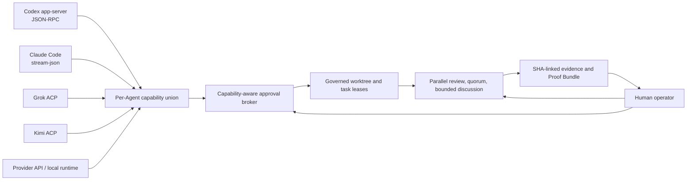
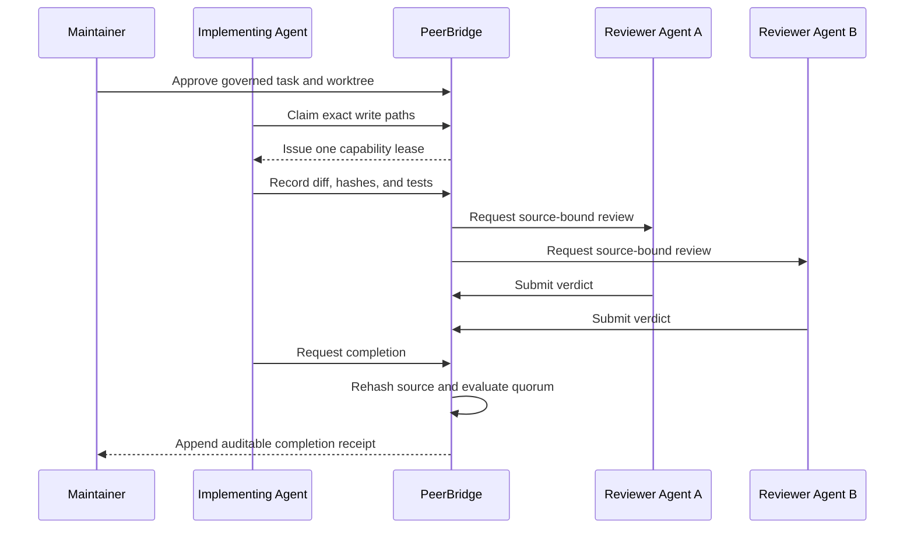

# PeerBridge Technical Showcase

PeerBridge is a provider-native adapter, collaboration, and governance layer for
multi-Agent engineering. This page maps each public claim to a reproducible workflow,
source contract, or test. It is not a benchmark of model intelligence.

## Architecture



The adapter layer is a capability union, not a lowest-common-denominator interface. A
feature missing from one adapter is refused for that route only; it does not hide a verified
feature from another Agent.

## Claims and evidence

| Public claim | Enforced contract | Reproducible evidence |
| --- | --- | --- |
| Provider-native adapters | Codex JSON-RPC, Claude stream-json, and Grok/Kimi ACP keep separate adapter and runtime identities. | `tests/test_agent_adapter_contract.py`, `tests/test_codex_approval_adapter.py`, `tests/test_claude_client_receipt.py`, `tests/test_acp_approval_callback.py` |
| Capability-aware approval | Allow once, allow for session, and deny decisions bind one Agent, adapter, tool, session, and request. | `tests/test_approval_broker.py`, `tests/test_acp_approval_callback.py` |
| One governed writer | Overlapping read/write scopes are checked transactionally before a lease is issued. | `examples/demo_workflow.py`, `tests/test_bridge.py` |
| Independent review and quorum | Reviews bind the exact live artifact hash; duplicate identities cannot satisfy additional votes. | `tests/test_bridge.py`, `tests/test_guided_room_workflows.py` |
| Bounded collaboration | Parallel rounds stop on consensus, blockers, stagnation, dispatch failure, or explicit budgets; replies do not trigger reply cascades. | `tests/test_room_discussion_tracker.py`, `tests/test_room_fanout_receipt.py` |
| Source-bound memory and history | Imports select nothing by default; memory uses explicit Private, Room, and Project scopes with source hashes. | `tests/test_native_history_adapters.py`, `tests/test_decision_memory.py` |
| Verifiable completion | Completion rehashes changed files and checks the selected review policy before closing the lease. | `examples/demo_workflow.py`, `tests/test_proof_bundle.py` |
| Observable, local-first operation | PeerBridge records captured activity and usage without claiming hidden reasoning; secrets stay outside SQLite and chat. | `tests/test_usage.py`, `SECURITY.md`, `docs/threat-model.md` |

## Run the provider-free showcase

```powershell
python examples\demo_workflow.py --workspace demo-workspace --scope demo
peerbridge doctor --project-root demo-workspace --scope demo
peerbridge monitor --project-root demo-workspace --scope demo
```

The first command emits a `peerbridge.maintainer-showcase.v1` receipt. A passing receipt
must show:

- `synthetic: true`;
- four separate adapter contract identities;
- `overlapping_writer_rejected: true`;
- two distinct approved reviewers;
- different before and after artifact hashes;
- `audit.valid: true` and `audit.writes_performed: 0`.

The showcase never emits the write lease capability. It demonstrates PeerBridge's
coordination and evidence contracts without requiring a paid model account.

## Real maintainer workflow



This maps directly to pull-request review, issue triage, release gates, security review,
and maintainer automation. Coding clients still perform the actual repository work using
their normal tools; PeerBridge governs identity, coordination, approval, and evidence.

## Boundaries

- A synthetic adapter identity is not proof of a live provider session.
- A route label is not proof of upstream model provenance.
- Peer review does not grant shell permission or apply a patch.
- Proof Bundles are useful only when verified against trusted source state.
- Remote/mobile control remains Experimental and default-off.
